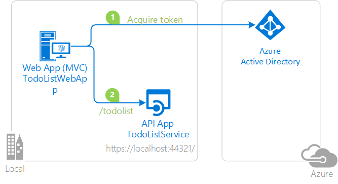

# Calling a web api using an application identity

> There's a newer version of this sample! Check it out: <https://github.com/azure-samples/ms-identity-aspnet-daemon-webapp>
>
> This newer sample takes advantage of the Microsoft identity platform (formerly Azure AD v2.0).
>
> While still in public preview, every component is supported in production environments

### Overview

In contrast to the WebApp-WebAPI-OpenIDConnect-DotNet sample, this sample shows how to build an MVC web application that uses Azure AD for sign-in using OpenID Connect, and then calls a web API under the application's identity (instead of the user's identity) using tokens obtained via OAuth 2.0. It is an example of the trusted sub-system model, where the web API trusts the web application to have authenticated the user, and receives no direct evidence from Azure AD that the user was authenticated. 

This sample uses the OpenID Connect ASP.Net OWIN middleware to sign-in the user in the Web App, and ADAL.Net to acquire a token for the Web API. It also the Jwt OWIN middleware on the Web API to validate the token received from the Web App.

For more information about how the protocols work in this scenario and other scenarios, see [Authentication Scenarios for Azure AD](http://go.microsoft.com/fwlink/?LinkId=394414).

This sample demonstrates a .NET 4.6.1 Web App (MVC) application calling a ASP.NET Web API that is secured using Azure Active Directory.

1. The .Net TodoListClient .NET 4.6.1 Web App (MVC) application uses the Active Directory Authentication Library (ADAL) to obtain a JWT access token from Azure Active Directory (Azure AD):
2. The access token is used as a bearer token to authenticate the user when calling the ASP.NET Web API.

## How to run this sample

To run this sample, you'll need:

- [Visual Studio 2017](https://aka.ms/vsdownload)
- An Internet connection
- An Azure Active Directory (Azure AD) tenant. For more information on how to get an Azure AD tenant, see [How to get an Azure AD tenant](https://azure.microsoft.com/en-us/documentation/articles/active-directory-howto-tenant/)
- A user account in your Azure AD tenant. This sample will not work with a Microsoft account (formerly Windows Live account). Therefore, if you signed in to the [Azure portal](https://portal.azure.com) with a Microsoft account and have never created a user account in your directory before, you need to do that now.

### Step 1:  Clone or download this repository

From your shell or command line:

`git clone https://github.com/Azure-Samples/active-directory-dotnet-webapp-webapi-oauth2-appidentity.git`

> Given that the name of the sample is pretty long, and so are the name of the referenced NuGet pacakges, you might want to clone it in a folder close to the root of your hard drive, to avoid file size limitations on Windows.

### Step 2:  Register the sample with your Azure Active Directory tenant

There are two projects in this sample. Each needs to be separately registered in your Azure AD tenant. To register these projects, you can:

- either follow the steps in the paragraphs below ([Step 2](#step-2--register-the-sample-with-your-azure-active-directory-tenant) and [Step 3](#step-3--configure-the-sample-to-use-your-azure-ad-tenant))
- or use PowerShell scripts that:
  - **automatically** create for you the Azure AD applications and related objects (passwords, permissions, dependencies)
  - modify the Visual Studio projects' configuration files.

If you want to use this automation, read the instructions in [App Creation Scripts](./AppCreationScripts/AppCreationScripts.md)

#### First step: choose the Azure AD tenant where you want to create your applications

As a first step you'll need to:

1. Sign in to the [Azure portal](https://portal.azure.com).
1. On the top bar, click on your account, and then on **Switch Directory**.
1. Once the *Directory + subscription* pane opens, choose the Active Directory tenant where you wish to register your application, from the *Favorites* or *All Directories* list.
1. Click on **All services** in the left-hand nav, and choose **Azure Active Directory**.

> In the next steps, you might need the tenant name (or directory name) or the tenant ID (or directory ID). These are presented in the **Properties**
of the Azure Active Directory window respectively as *Name* and *Directory ID*

#### Register the service app (TodoListService-AppIdentity)

1. In the  **Azure Active Directory** pane, click on **App registrations** and choose **New application registration**.
1. Enter a friendly name for the application, for example 'TodoListService-AppIdentity' and select 'Web app / API' as the *Application Type*.
1. For the *sign-on URL*, enter the base URL for the sample. By default, this sample uses `https://localhost:44321/`.
1. Click **Create** to create the application.
1. In the succeeding page, Find the *Application ID* value and record it for later. You'll need it to configure the Visual Studio configuration file for this project.
1. Then click on **Settings**, and choose **Properties**.
1. For the App ID URI, replace the guid in the generated URI 'https://\<your_tenant_name\>/\<guid\>', with the name of your service, for example, 'https://\<your_tenant_name\>/TodoListService-AppIdentity' (replacing `<your_tenant_name>` with the name of your Azure AD tenant)

#### Register the WebApp app (TodoListWebApp-AppIdentity)

1. In the  **Azure Active Directory** pane, click on **App registrations** and choose **New application registration**.
1. Enter a friendly name for the application, for example 'TodoListWebApp-AppIdentity' and select 'Web app / API' as the *Application Type*.
1. For the *sign-on URL*, enter the base URL for the sample. By default, this sample uses `https://localhost:44322/`.
1. Click **Create** to create the application.
1. In the succeeding page, Find the *Application ID* value and record it for later. You'll need it to configure the Visual Studio configuration file for this project.
1. Then click on **Settings**, and choose **Properties**.
1. For the App ID URI, replace the guid in the generated URI 'https://\<your_tenant_name\>/\<guid\>', with the name of your service, for example, 'https://\<your_tenant_name\>/TodoListWebApp-AppIdentity' (replacing `<your_tenant_name>` with the name of your Azure AD tenant)
1. From the **Settings** | **Reply URLs** page for your application, update the Reply URL for the application to be `https://localhost:44322/`
1. From the Settings menu, choose **Keys** and add a new entry in the Password section:

   - Type a key description (of instance `app secret`),
   - Select a key duration of either **In 1 year**, **In 2 years**, or **Never Expires**.
   - When you save this page, the key value will be displayed, copy, and save the value in a safe location.
   - You'll need this key later to configure the project in Visual Studio. This key value will not be displayed again, nor retrievable by any other means,
     so record it as soon as it is visible from the Azure portal.
1. Configure Permissions for your application. To that extent, in the Settings menu, choose the 'Required permissions' section and then,
   click on **Add**, then **Select an API**, and type `TodoListService-AppIdentity` in the textbox. Then, click on  **Select Permissions** and select **Access 'TodoListService-AppIdentity'**.

### Step 3:  Configure the sample to use your Azure AD tenant

In the steps below, "ClientID" is the same as "Application ID" or "AppId".

Open the solution in Visual Studio to configure the projects

#### Configure the service project

1. Open the `TodoListService\Web.Config` file
1. Find the app key `ida:Tenant` and replace the existing value with your Azure AD tenant name.
1. Find the app key `ida:Audience` and replace the existing value with the App ID URI you registered earlier for the TodoListService-AppIdentity app. For instance use `https://<your_tenant_name>/TodoListService-AppIdentity`, where `<your_tenant_name>` is the name of your Azure AD tenant.
1. Find the app key `todo:TrustedCallerClientId` and replace the existing value with the application ID (clientId) of the `TodoListWebApp-AppIdentity` application copied from the Azure portal.

#### Configure the WebApp project

1. Open the `TodoListWebApp\Web.Config` file
1. Find the app key `ida:Tenant` and replace the existing value with your Azure AD tenant name.
1. Find the app key `ida:ClientId` and replace the existing value with the application ID (clientId) of the `TodoListWebApp-AppIdentity` application copied from the Azure portal.
1. Find the app key `ida:RedirectUri` and replace the existing value with the Redirect URI for TodoListWebApp-AppIdentity app. For example, 'https://localhost:44322/' .
1. Find the app key `ida:AppKey` and replace the existing value with the key you saved during the creation of the `TodoListWebApp-AppIdentity` app, in the Azure portal.
1. Find the app key `todo:TodoListResourceId` and replace the existing value with the App ID URI you registered earlier for the TodoListService-AppIdentity app. For instance use `https://<your_tenant_name>/TodoListService-AppIdentity`, where `<your_tenant_name>` is the name of your Azure AD tenant.
1. Find the app key `todo:TodoListBaseAddress` and replace the existing value with the base address of the TodoListService-AppIdentity project (by default `https://localhost:44321/`).

#### Configure the TodoListWebApp as a trusted caller to the TodoListService

1. Go back to the TodoListService project and open the `web.config` file.
2. Find the app key `todo:TrustedCallerClientId` and replace the value with the Application ID of the TodoListWebApp.  This is used to tell the service to trust the web app.

### Step 4: Run the sample

Clean the solution, rebuild the solution, and run it.  You might want to go into the solution properties and set both projects as startup projects, with the service project starting first.

Explore the sample by signing in, clicking the To Do List link, adding items to the To Do list, signing out, and starting again.

## About The Code

This sample is an example of the trusted sub-system model, where the web API trusts the web application to have authenticated the user, and receives no direct evidence from Azure AD that the user was authenticated.  If you want to build a web app that calls a web API using a delegated user identity, please check out the sample named WebApp-WebAPI-OpenIDConnect-DotNet.

### Create and publish the `TodoListService-AppIdentity` to an Azure Web Site

1. Sign in to the [Azure portal](https://portal.azure.com).
2. Click **Create a resource** in the top left-hand corner, select **Web + Mobile** --> **Web App**, select the hosting plan and region, and give your web site a name, for example, `TodoListService-AppIdentity-contoso.azurewebsites.net`.  Click Create Web Site.
3. Once the web site is created, click on it to manage it.  For this set of steps, download the publish profile by clicking **Get publish profile** and save it.  Other deployment mechanisms, such as from source control, can also be used.
4. Switch to Visual Studio and go to the TodoListService project.  Right click on the project in the Solution Explorer and select **Publish**.  Click **Import Profile** on the bottom bar, and import the publish profile that you downloaded earlier.
5. Click on **Settings** and in the `Connection tab`, update the Destination URL so that it is https, for example [https://TodoListService-AppIdentity-contoso.azurewebsites.net](https://TodoListService-AppIdentity-contoso.azurewebsites.net). Click Next.
6. On the Settings tab, make sure `Enable Organizational Authentication` is NOT selected.  Click **Save**. Click on **Publish** on the main screen.
7. Visual Studio will publish the project and automatically open a browser to the URL of the project.  If you see the default web page of the project, the publication was successful.

### Update the Active Directory tenant application registration for `TodoListService-AppIdentity`

1. Navigate to the [Azure portal](https://portal.azure.com).
2. On the top bar, click on your account and under the **Directory** list, choose the Active Directory tenant containing the `TodoListService-AppIdentity` application.
3. On the applications tab, select the `TodoListService-AppIdentity` application.
4. From the Settings -> Reply URLs menu, update the Sign-On URL, and Reply URL fields to the address of your service, for example [https://TodoListService-AppIdentity-contoso.azurewebsites.net](https://TodoListService-AppIdentity-contoso.azurewebsites.net). Save the configuration.

### Update the `TodoListWebApp-AppIdentity` to call the `TodoListService-AppIdentity` Running in Azure Web Sites

1. In Visual Studio, go to the `TodoListWebApp-AppIdentity` project.
2. Open `TodoListWebApp\Web.Config`.  Only one change is needed - update the `todo:TodoListBaseAddress` key value to be the address of the website you published,
   for example, [https://TodoListService-AppIdentity-contoso.azurewebsites.net](https://TodoListService-AppIdentity-contoso.azurewebsites.net).
3. Run the client! If you are trying multiple different client types (for example, .Net, Windows Store, Android, iOS) you can have them all call this one published web API.

### Create and publish the `TodoListWebApp-AppIdentity` to an Azure Web Site

1. Sign in to the [Azure portal](https://portal.azure.com).
2. Click **Create a resource** in the top left-hand corner, select **Web + Mobile** --> **Web App**, select the hosting plan and region, and give your web site a name, for example, `TodoListWebApp-AppIdentity-contoso.azurewebsites.net`.  Click Create Web Site.
3. Once the web site is created, click on it to manage it.  For this set of steps, download the publish profile by clicking **Get publish profile** and save it.  Other deployment mechanisms, such as from source control, can also be used.
4. Switch to Visual Studio and go to the TodoListService project.  Right click on the project in the Solution Explorer and select **Publish**.  Click **Import Profile** on the bottom bar, and import the publish profile that you downloaded earlier.
5. Click on **Settings** and in the `Connection tab`, update the Destination URL so that it is https, for example [https://TodoListWebApp-AppIdentity-contoso.azurewebsites.net](https://TodoListWebApp-AppIdentity-contoso.azurewebsites.net). Click Next.
6. On the Settings tab, make sure `Enable Organizational Authentication` is NOT selected.  Click **Save**. Click on **Publish** on the main screen.
7. Visual Studio will publish the project and automatically open a browser to the URL of the project.  If you see the default web page of the project, the publication was successful.

### Update the Active Directory tenant application registration for `TodoListWebApp-AppIdentity`

1. Navigate to the [Azure portal](https://portal.azure.com).
2. On the top bar, click on your account and under the **Directory** list, choose the Active Directory tenant containing the `TodoListWebApp-AppIdentity` application.
3. On the applications tab, select the `TodoListWebApp-AppIdentity` application.
4. From the Settings -> Reply URLs menu, update the Sign-On URL, and Reply URL fields to the address of your service, for example [https://TodoListWebApp-AppIdentity-contoso.azurewebsites.net](https://TodoListWebApp-AppIdentity-contoso.azurewebsites.net). Save the configuration.

> NOTE: Remember, the To Do list is stored in memory in this TodoListService sample. Azure Web Sites will spin down your web site if it is inactive, and your To Do list will get emptied.
Also, if you increase the instance count of the web site, requests will be distributed among the instances. To Do will, therefore, not be the same on each instance.

- 
## How To Recreate This Sample

First, in Visual Studio 2017 create an empty solution to host the  projects.  Then, follow these steps to create each project.

### Creating the TodoListService Project

1. In Visual Studio 2017, create a new `Visual C#` `ASP.NET Web Application (.NET Framework)` project  named `TodoListService`. In the next screen, choose the `Web Api` project template. While on this screen, click the **Change Authentication** button, select **Work or School Accounts**, choose **Cloud - Single Organization** in the first dropdown, and enter the name of your Azure AD tenant in the **Domain:** text box. You will be prompted to sign-in to your Azure AD tenant.  NOTE:  You must sign-in with a user that is in the tenant; you cannot, during this step, sign-in with a Microsoft account.
1. Set **SSL Enabled** to be True.  Note the SSL URL.
1. In the project properties, Web properties, set the Project Url to be the SSL URL.
1. In the `Models` folder add a new class called `TodoItem.cs`.  Copy the implementation of thi class from this sample into the newly created class.
1. Add a new, empty, `Web API 2 Controller - Empty` called `TodoListController` to the project.
1. Copy the implementation of the **TodoListController.cs** from this sample into the newly created controller.  Don't forget to add the `[Authorize]` attribute to the class.
1. In `TodoListController` resolving missing references as suggested by Visual Studio.
1. In `Web.config`, in `<appSettings>`, create a key `todo:TrustedCallerClientId` and set the value to the clientId (AppId) of the **TodoListWebApp** from the Azure portal.
1. Add the following ASP.Net OWIN middleware NuGets: **Microsoft.Owin.Security.ActiveDirectory**, **System.IdentityModel.Tokens.Jwt**, **Microsoft.IdentityModel.Protocols.WsFederation** and **Microsoft.Owin.Host.SystemWeb**.
1. In the `App_Start` folder, create a class `Startup.Auth.cs`.  You will need to remove `.App_Start` from the namespace name.  Replace the code for the `Startup` class with the code from the same file of the sample app.  Be sure to take the whole class definition!  The definition changes from `public class Startup` to `public partial class Startup`.
1. Right-click on the project, select Add,  select "OWIN Startup class", and name the class "Startup".  If "OWIN Startup Class" doesn't appear in the menu, instead select "Class", and in the search box enter "OWIN".  "OWIN Startup class" will appear as a selection; select it, and name the class `Startup.cs`.
1. In `Startup.cs`, replace the code for the `Startup` class with the code from the same file of the sample app.  Again, note the definition changes from `public class Startup` to `public partial class Startup`.

### Creating the TodoListWebApp Project

1. In the same solution, add a new `Visual C#` `ASP.NET Web Application (.NET Framework)` named `TodoListWebApp`. In the next screen, choose the `MVC` project template. While on this screen, leave with Authentication set to **No Authentication**.
1. Set **SSL Enabled** to be True.  Note the SSL URL.
1. In the project properties, Web properties, set the Project Url to be the SSL URL.
1. Add the following ASP.Net OWIN middleware NuGets: **System.IdentityModel.Tokens.Jwt**, **Microsoft.Owin.Security.OpenIdConnect**, **Microsoft.Owin.Security.Cookies** and **Microsoft.Owin.Host.SystemWeb**.
1. Add the Active Directory Authentication Library NuGet (`Microsoft.IdentityModel.Clients.ActiveDirectory`).
1. Add a reference for assembly **System.Security**.
1. In the `App_Start` folder, create a class `Startup.Auth.cs`.  You will need to remove `.App_Start` from the namespace name.  Replace the code for the `Startup` class with the code from the same file of the sample app.  Be sure to take the whole class definition!  The definition changes from `public class Startup` to `public partial class Startup`.
1. Right-click on the project, select Add,  select "OWIN Startup class", and name the class "Startup".  If "OWIN Startup Class" doesn't appear in the menu, instead select "Class", and in the search box enter "OWIN".  "OWIN Startup class" will appear as a selection; select it, and name the class `Startup.cs`.
1. In `Startup.cs`, replace the code for the `Startup` class with the code from the same file of the sample app.  Again, note the definition changes from `public class Startup` to `public partial class Startup`.
1. In the `Views` --> `Shared` folder, create a new **MVC 5 partial page (Razor)** named `_LoginPartial.cshtml`.  Replace the contents of the file with the contents of the file of same name from the sample.
1. In the `Views` --> `Shared` folder, replace the contents of `_Layout.cshtml` with the contents of the file of same name from the sample.  Effectively, all this will do is add a single line, `@Html.Partial("_LoginPartial")`, that lights up the previously added `_LoginPartial` view.
1. Create a new **MVC 5 Controller - Empty** named `AccountController`.  Replace the implementation with the contents of the file of same name from the sample.
1. If you want the user to be required to sign-in before they can see any page of the app, then in the `HomeController`, decorate the `HomeController` class with the `[Authorize]` attribute.  If you leave this out, the user will be able to see the home page of the app without having to sign-in first, and can click the sign-in link on that page to get signed in.
1. In the `Models` folder add a new class called `TodoItem.cs`.  Copy the implementation of TodoItem from this sample into the class.
1. 1. In the `Models` folder add a new class called `FileCache.cs`.  Copy the implementation of FileCache from this sample into the class.
1. Add a new **MVC 5 Controller - Empty** named `TodoListController` to the project.  Copy the implementation of the controller from the sample.  Remember to include the [Authorize] attribute on the class definition.
1. In `Views` --> `TodoList` create a new view, `Index.cshtml`, and copy the implementation from this sample.
1. In `Web.config`, in `<appSettings>`, create keys for `ida:ClientId`, `ida:AppKey`, `ida:Tenant`, `ida:AADInstance`, `ida:RedirectUri`, `ida:TodoListResourceId`, and `ida:TodoListBaseAddress`, and set the values accordingly.  For the public Azure AD, the value of `ida:AADInstance` is `https://login.microsoftonline.com/{0}`.

Finally, in the properties of the solution itself, set both projects as startup projects.

## Community Help and Support

Use [Stack Overflow](http://stackoverflow.com/questions/tagged/adal) to get support from the community.
Ask your questions on Stack Overflow first and browse existing issues to see if someone has asked your question before.
Make sure that your questions or comments are tagged with [`adal` `dotnet`].

If you find a bug in the sample, please raise the issue on [GitHub Issues](../../issues).

To provide a recommendation, visit the following [User Voice page](https://feedback.azure.com/forums/169401-azure-active-directory).

## Contributing

If you'd like to contribute to this sample, see [CONTRIBUTING.MD](/CONTRIBUTING.md).

This project has adopted the [Microsoft Open Source Code of Conduct](https://opensource.microsoft.com/codeofconduct/). For more information, see the [Code of Conduct FAQ](https://opensource.microsoft.com/codeofconduct/faq/) or contact [opencode@microsoft.com](mailto:opencode@microsoft.com) with any additional questions or comments.

## More information

For more information, see ADAL.NET's conceptual documentation:

- [OpenID Connect](https://docs.microsoft.com/en-us/azure/active-directory/develop/active-directory-protocols-openid-connect-code)
- [Service to service calls](https://docs.microsoft.com/en-us/azure/active-directory/develop/active-directory-protocols-oauth-service-to-service)
- [Active directory authentication library (ADAL.NET)](https://github.com/AzureAD/azure-activedirectory-library-for-dotnet/wiki)
- [Recommended pattern to acquire a token](https://github.com/AzureAD/azure-activedirectory-library-for-dotnet/wiki/AcquireTokenSilentAsync-using-a-cached-token#recommended-pattern-to-acquire-a-token)
- [Customizing Token cache serialization](https://github.com/AzureAD/azure-activedirectory-library-for-dotnet/wiki/Token-cache-serialization)

For more information about how OAuth 2.0 protocols work in this scenario and other scenarios, see [Authentication Scenarios for Azure AD](http://go.microsoft.com/fwlink/?LinkId=394414).
